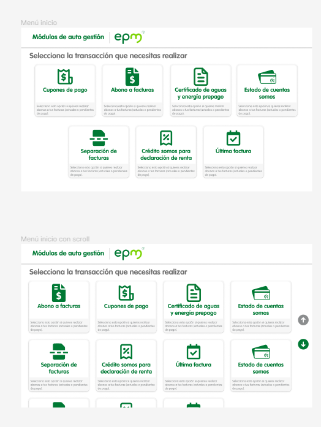
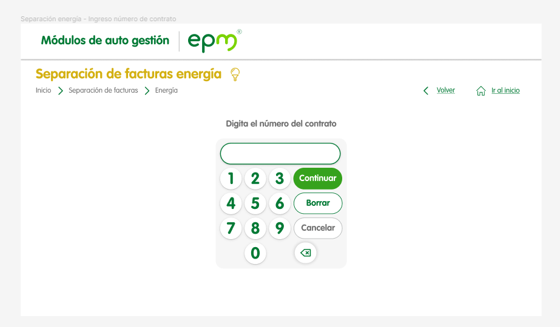

# EjercicioCuponeras

Proyecto de maquetacion del proyecto cuponeras epm para la nivelacion de los integrantes de experiencia digital

## Inidicaciones

Se propone maquetar algunas paginas del proyecto de cuponeras epm utilizando unicamente html, css y javascript, la idea es que trabajen en equipo y se repartan las paginas o los componentes, la maquetación de la pagina si bien no debe ser 100% responsiva, los elementos se deben adaptar a las dimensiones de la pantalla

### Objetivos

- Reforzar conceptos de html y css
- Enlazar varios htmls entre si a traves de links
- Empezar a utilizar javascript para interactuar con el dom de la pagina
- Utilizar herramientas de versionamiento de codigo como es git, la cual les permitira trabajar en equipo e ir integrando todo el proyecto

### Pantallas a desarrollar

- Pantalla de inicio, para esta pantalla aparte de maquetarla deben crear el comportamiento de scroll, cuando se tengan más de 8 transacciones.

  

- La pantalla de separación de facturas se llega a traves de la carta de separación de facturas, deben hacer funcional los links de volver e ir al inicio que se muestran en la pantalla.

  

- La pantalla de separación facturas energia se debe de abrir cuando se le de click a la carta energía de la pantalla anterior. En el teclado numerico cuando se haga click sobre alguno de los botones, este se debe de ver reflejado en el input,el boton de continuar nos debe de llevar a la siguiente página, el boton de borrar debe borrar todos los numeros del input, el boton de cancelar nos debe de devolver a la página anterior, el boton de delete debe borrar solo un caracter del input.
  

- En la pantalla de ayuda al planeta, cuando se haga click sobre el boton deseo "llevar mi recibo impreso" la siguiente pantalla sera :  **Confirmación de impresión**, si se da click sobre el boton de "Deseo recibirlo por correo" se debera navegar a la pantalla de: **Envio al correo**

- Pantalla confirmación de impresión, en la pantalla cuando se de click sobre el boton "imprimir", nos deberia de llevar a la página de inicio

-Pantalla de envio al correo. El teclado de esta pantalla tendrá un comportamiento similar al teclado numerico, cuando el usuario de click en el boton "Enviar", se debera redirigir a la pantalla de inicio.

### Notas
- Las imágenes del proyecto se encuentran en la carpeta assets/images
- Las fuentes que utiliza el proyecto se encuentran en la carpeta assets/fonts
- Todos los scripts de javascript se deberán de guardar en la carpeta scripts.
- El link del diseño de las pantallas es el siguiente: [Cuponera](https://www.figma.com/file/pNQ6wlNobvKAEq7azAtJjI/EPM-CUPONERAS-V.02?node-id=799%3A4853&t=imSDziMTiHZxnueh-0)
- En el archivo styless.css se encuentra la importación de las fuentes para el proyecto
- **No utilizar librerias de node js**